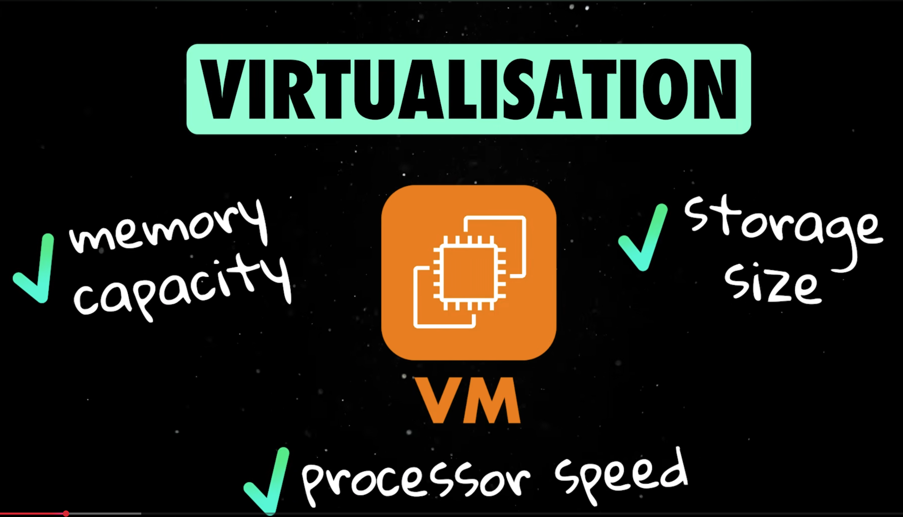

# Virtualize

**Free, cross-platform VM orchestration for AI workflows.**

Virtualize gives AI agents (and humans) full VM lifecycle management with built-in MCP integration, sandboxed code execution, and a compliance-ready architecture (SOC 1/2/3, HIPAA, ISO 27001).



## Why Virtualize?

Most AI workflows need sandboxed environments — to run generated code safely, test deployments, or give agents real OS-level access. Existing solutions are either cloud-locked, expensive, or platform-specific.

Virtualize is:
- **Free & open-source** (Apache 2.0)
- **Cross-platform** — Linux (KVM), macOS (Hypervisor.framework), Windows (WHPX/Hyper-V)
- **MCP-native** — AI agents interact with VMs via the Model Context Protocol
- **Compliance-ready** — audit logging, encryption, integrity chains, policy controls

## Architecture

```
┌──────────────────────────────────────────────────────────┐
│                     AI Agents / Users                     │
├────────────┬────────────┬────────────┬───────────────────┤
│  MCP Server│    CLI     │  REST API  │  Web Dashboard    │
├────────────┴────────────┴────────────┴───────────────────┤
│                    VM Manager                             │
│              (orchestration + audit)                      │
├──────────────────────┬───────────────────────────────────┤
│   Sandbox Executor   │     Compliance Engine             │
│  (pooled isolation)  │  (audit log + policy controls)    │
├──────────────────────┴───────────────────────────────────┤
│               Hypervisor Abstraction                      │
│    ┌──────────┬──────────────┬──────────────┐            │
│    │ QEMU/KVM │ HVF (macOS)  │ WHPX (Win)   │            │
│    └──────────┴──────────────┴──────────────┘            │
└──────────────────────────────────────────────────────────┘
```

## Features

### VM Management
- Create, start, stop, destroy VMs with configurable CPU, memory, disk, network
- GPU passthrough (VFIO on Linux) and virtual GPU support
- Cloud-init support for automated provisioning
- NAT, bridge, isolated, and host networking modes
- Pre-built image support with copy-on-write overlays

### MCP Server (for AI Agents)
- **12 tools** exposed via the Model Context Protocol
- `vm_create`, `vm_start`, `vm_stop`, `vm_destroy` — full lifecycle
- `vm_exec` — run commands inside VMs
- `sandbox_run` — one-shot isolated code execution
- `vm_file_read`, `vm_file_write` — filesystem access
- `compliance_report`, `audit_query`, `audit_verify` — compliance tools

### Sandboxed Code Execution
- Run code in isolated VMs with strict resource limits
- Timeout enforcement, CPU/memory caps
- Pre-warmed VM pool for fast execution
- Supports Python, Bash, Node.js, Ruby, Perl

### Compliance
- **SOC 1/2/3** — Trust Services Criteria controls
- **HIPAA** — 45 CFR § 164.312 audit and access controls
- **ISO 27001** — Annex A security controls
- Immutable, integrity-chained audit logs (SHA-256 HMAC)
- Optional encryption at rest (Fernet / AES-128-CBC)
- Tamper detection with chain verification
- Structured JSON logs for SIEM ingestion

### Web Dashboard
- Modern React UI with real-time VM monitoring
- Create, start, stop, destroy VMs from the browser
- In-browser terminal for VM command execution
- Compliance report viewer

## Formal Algebra

Virtualize is not just an MCP — it is an **executable algebra**. Every tool is a typed morphism over a formally defined state space, with verified axioms and constraint enforcement.

### Classification

> **Virtualize MCP ≅ a typed, finite, partially-defined monoidal category with audit-preserving invariants**

### Structure

| Component | Definition |
|-----------|-----------|
| **Carrier set** `C` | `{VM states, Sandbox states, Filesystem states, Audit states}` |
| **Generators** `T` | 13 typed morphisms (`vm_create`, `vm_start`, ..., `compliance_report`) |
| **Composition** `∘` | `t_i ∘ t_j ∈ T*` (free monoid over tools) |
| **Identity** `id` | `id ∘ t = t = t ∘ id` for all `t ∈ T` |
| **Constraint subalgebra** | `T_valid ⊆ T*` (compliance policies restrict valid compositions) |

### Typed Transitions

Each tool is a morphism `t_i : C_source → C_target` with explicit preconditions:

```
vm_create  : vm.nonexistent → vm.created
vm_start   : vm.created | vm.stopped → vm.running
vm_stop    : vm.running | vm.paused → vm.stopped
vm_destroy : vm.created | vm.running | vm.stopped | vm.paused → vm.destroyed
vm_exec    : vm.running → vm.running  (endomorphism)
```

### Verified Axioms

```bash
$ virtualize algebra verify

  PASS  identity — id ∘ t = t = t ∘ id holds for all generators
  PASS  closure — All generators map C → C
  PASS  associativity — (t₁ ∘ t₂) ∘ t₃ = t₁ ∘ (t₂ ∘ t₃)
  PASS  audit_monotonicity — A_{n+1}.seq ≥ A_n.seq
  PASS  audit_irreversibility — ∄ t such that t(A_n) = A_{n-1}
  PASS  transition_determinism — All transitions are deterministic
```

### Key Properties

- **Non-commutative**: `create ∘ start ≠ start ∘ create` (proven in tests)
- **Audit chain**: `A_{n+1} = H(A_n ∥ e_n)` — monotonic, irreversible, append-only
- **Constraint subalgebra**: Compliance policies define `T_valid ⊆ T*` (e.g., SOC2 blocks file reads when audit is tampered)
- **Algebraic rewriting**: Identity elimination, idempotent collapse, annihilation (`create ∘ destroy = id`), dead code elimination

### Plan Validation

Validate execution plans *before* running them:

```bash
# Valid lifecycle
$ virtualize algebra validate '[
  ["vm_create", null, {"name": "my-vm"}],
  ["vm_start", "my-vm", {}],
  ["vm_exec", "my-vm", {"command": "echo hello"}],
  ["vm_stop", "my-vm", {}],
  ["vm_destroy", "my-vm", {}]
]'
# → VALID — 5 steps validated

# Invalid: exec on nonexistent VM
$ virtualize algebra validate '[["vm_exec", "ghost", {}]]'
# → INVALID — vm_exec requires VM 'ghost' in {vm.running}, but it is in 'vm.nonexistent'
```

### Plan Optimization

```bash
$ virtualize algebra rewrite '[
  ["identity", null, {}],
  ["vm_create", "vm-1", {"name": "vm-1"}],
  ["identity", null, {}],
  ["vm_start", "vm-1", {}],
  ["vm_status", "vm-1", {}],
  ["vm_status", "vm-1", {}],
  ["vm_destroy", "vm-1", {}]
]'
# → Original: 7 steps → Optimized: 4 steps (3 eliminated via algebraic laws)
```

## Quick Start

### Prerequisites

The easiest way — let Virtualize detect your OS and install everything:

```bash
pip install -e .
virtualize setup
```

This will detect your OS, distro, package manager, hardware acceleration, and GPU — then install QEMU with the correct commands for your platform.

Or install manually:

```bash
# Linux (Ubuntu/Debian)
sudo apt install qemu-system-x86 qemu-utils

# Linux (Fedora/RHEL)
sudo dnf install qemu-system-x86 qemu-img

# macOS
brew install qemu

# Windows
choco install qemu
# or download from https://qemu.org/download
```

### Install Virtualize

```bash
pip install -e .
```

### CLI Usage

```bash
# Create a VM
virtualize create my-dev-vm --cpus 4 --memory 4096 --disk 50

# Start it
virtualize start <vm_id>

# Run a command inside
virtualize exec <vm_id> "uname -a"

# Run sandboxed code
virtualize sandbox run "print('hello from sandbox')" --lang python

# List VMs
virtualize list

# Stop and destroy
virtualize stop <vm_id>
virtualize destroy <vm_id>
```

### API Server + Web Dashboard

```bash
# Start the API server (includes dashboard at http://localhost:8420)
python -m uvicorn virtualize.api.server:app --host 0.0.0.0 --port 8420
```

### MCP Server (for AI Agents)

Add to your MCP client configuration:

```json
{
  "mcpServers": {
    "virtualize": {
      "command": "python",
      "args": ["-m", "virtualize.mcp_server.server"]
    }
  }
}
```

Or start via CLI:
```bash
virtualize mcp serve
```

### Compliance

```bash
# Generate a SOC 2 compliance report
virtualize compliance report soc2

# Verify audit log integrity
virtualize compliance audit-verify

# Query audit events
virtualize compliance audit-query --actor alice --limit 20
```

## API Reference

### REST Endpoints

| Method | Path | Description |
|--------|------|-------------|
| `GET` | `/` | Web dashboard |
| `GET` | `/health` | Health check |
| `POST` | `/api/v1/vms` | Create VM |
| `GET` | `/api/v1/vms` | List VMs |
| `GET` | `/api/v1/vms/{id}` | Get VM details |
| `POST` | `/api/v1/vms/{id}/start` | Start VM |
| `POST` | `/api/v1/vms/{id}/stop` | Stop VM |
| `DELETE` | `/api/v1/vms/{id}` | Destroy VM |
| `POST` | `/api/v1/vms/{id}/exec` | Execute command in VM |
| `POST` | `/api/v1/sandbox/run` | Sandboxed code execution |
| `GET` | `/api/v1/vms/{id}/files?path=` | Read file from VM |
| `POST` | `/api/v1/vms/{id}/files` | Write file to VM |
| `GET` | `/api/v1/compliance/report/{fw}` | Compliance report |
| `GET` | `/api/v1/compliance/controls` | List controls |
| `GET` | `/api/v1/audit/events` | Query audit log |
| `GET` | `/api/v1/audit/verify` | Verify audit integrity |
| `GET` | `/api/v1/system/info` | System information |

### MCP Tools

| Tool | Description |
|------|-------------|
| `vm_create` | Create a new VM |
| `vm_start` | Start a VM |
| `vm_stop` | Stop a VM |
| `vm_destroy` | Destroy a VM |
| `vm_list` | List all VMs |
| `vm_status` | Get VM status |
| `vm_exec` | Execute command in VM |
| `sandbox_run` | Isolated code execution |
| `vm_file_read` | Read file from VM |
| `vm_file_write` | Write file to VM |
| `compliance_report` | Generate compliance report |
| `audit_query` | Query audit events |
| `audit_verify` | Verify audit log integrity |

## Development

```bash
# Install with dev dependencies
pip install -e ".[dev]"

# Run tests
pytest

# Lint
ruff check src/ tests/

# Type check
mypy src/
```

## Project Structure

```
virtualize/
├── src/virtualize/
│   ├── core/
│   │   ├── models.py        # Data models (VM, Exec, Audit)
│   │   ├── hypervisor.py    # Cross-platform hypervisor abstraction
│   │   └── manager.py       # VM lifecycle orchestration
│   ├── sandbox/
│   │   └── executor.py      # Sandboxed code execution engine
│   ├── compliance/
│   │   ├── audit.py         # Integrity-chained audit logging
│   │   └── policies.py      # SOC/HIPAA/ISO policy controls
│   ├── mcp_server/
│   │   └── server.py        # MCP server (13 tools)
│   ├── api/
│   │   ├── server.py        # FastAPI REST server
│   │   └── dashboard.py     # Built-in web dashboard
│   └── cli/
│       └── main.py          # Typer CLI
├── tests/
├── mcp-config.json           # MCP client configuration
├── pyproject.toml
└── README.md
```

## License

Apache License 2.0
